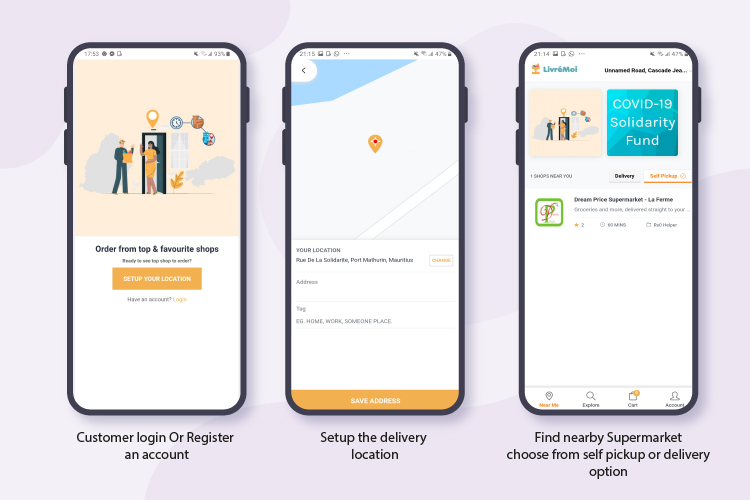

# Livré-Moi
LivréMoi Mauritius - Buy at local Shop online, Track your order till your doorstep.

Available in both mainland Mauritius and Rodrigues Island.

You can get all the items you need from the comfort of your home.
# Vegetables,
# Fruits,
# Grocery; Pasta, Cooking Oil, Rice, Tea, Milk, Salt, Sugar, Honey etc,
# Skin care; Lotions, Scrubs, Facial items etc,
# Hair care; Shampoos, Conditioners, Hair Oils etc,
# Fresh Meat; Chicken, Mutton, Beef, Fish Seafood etc,
# Icecreams,
# Pads; always, etc..
# And the list goes on!

LivréMoi Mauritius is your easiest way to order products from local supermarkets and shops in proximity.

Mauritius is on to innovation with LivréMoi Mauritius.

Use LivréMoi Mauritius to access large range of categories and products while enjoying multiple benefits:

Features:
1. Juice transfer or Cash On Delivery (COD)
Did you get a faulty product? Don’t worry, we replace it for you or you get your money back!

2. Delivery Boy ✓
We have well-trained, delivery boy and safe riders. Just for your convenience!

3. Timely Delivery
We deliver our promises and the first promise, we make is that of delivering on time!

4. Have an entire supermarket at your fingertips.

5. No delivery charges on a certain order amount.

8. Track your delivery with order tracking with GPS assist.

9. Shop amazing products from a variety of shops and suppliers from all across the Island, all at a single click of a button.

LivréMoi Mauritius, delivering your household happiness.

Dev: Joseph Jonathan Collet
Email: dykelaway@gmail.com
